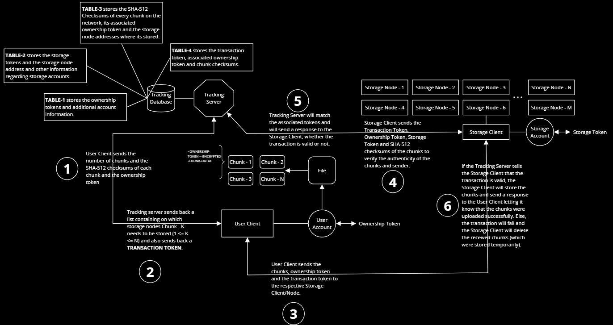

# Decentralized File Storage Network (dFSN)
dFSN is a small distributed file storage newtwork which allows the user to split and disperse their files over a network ensuring that other than the user no one else can re-construct the files. The network utilises gRPC for transmission and sodium for file encryption. The network is peer-to-peer eliminating any middle man between the user and the storage nodes.

>**Note**: This project is currently under development and this README would be updated as the project progresses.

## Techstack (will be updated as development continues)
C/C++, gRPC, Sodium, protobuf, SQLite

## Architecture of the Network

### Ideology behind the Network
As illustrated in the diagram, the user client would decide the distribution of encypted chunks and the storage nodes which the client would send these chunks to would be decided by the tracking server.

Now one might ask won't the tracking server introduce some amount of centralization?

The purpose of the tracking servers is to:
- Balance the load across the nodes, otherwise some nodes might be overloaded while others underloaded

- Allow certain nodes to be grouped together, let's say some organization or a group of organizations want to share some data in a secure way each organization can be assured that their data stays on their nodes and due to the nature of file dispersion even an insider cannot leak any data.

>**Note**: Unless the specific client that dispersed the chunks gets compromised. Since only that specific client knows on which nodes the chunks exist.

- From a commercial standpoint, if we were to present this as a decentralized Google Drive or Dropbox of some sort then we can store the dispersion information (see above note) in a backup service and charge users for that service. Ofcourse that service would be optional and you can avoid using it by simplying managing that information yourself.

If this were commercial how would we get the storage nodes?
- Businesses which have their own hosting infrastructure generally have spare storage space which they don't really use but still have to bear the expense of maintaining it. Such players can devote a set (guranteed for use by dFSN) amount of storage to the network, have their own tracking server and charge users / incentivise them to use their nodes.

- Since this is a decentralized network nodes can go down and may never come back up since they are not under our direct control. To mitigate this each chunk will obviously be on more than one node for redundancy purposes, and the users can have an option to also disperse some or all of their chunks to one or more of the above mentioned privately owned chunks which would be guranteed to be up.

## Setup
Instructions would be updated soon.