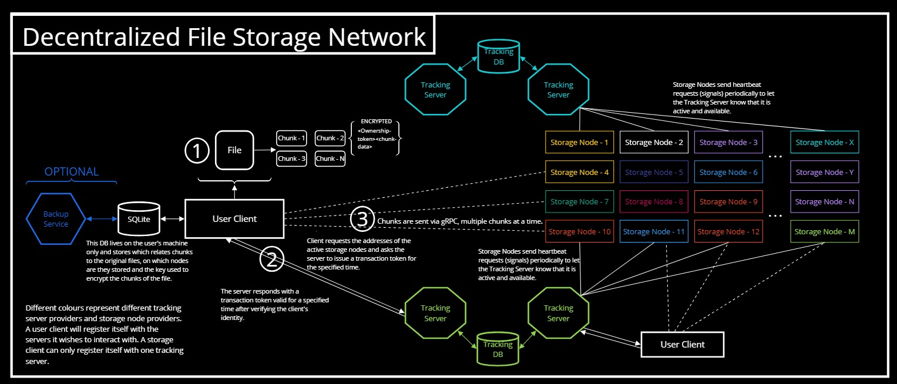
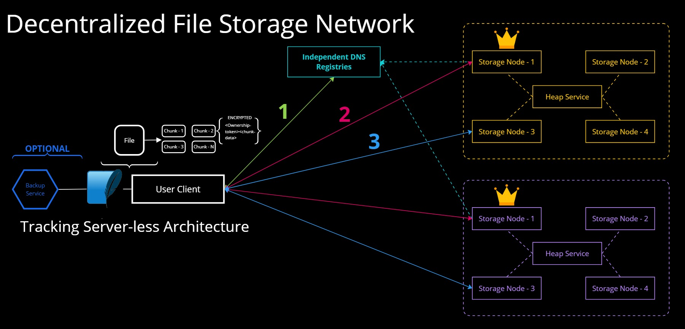
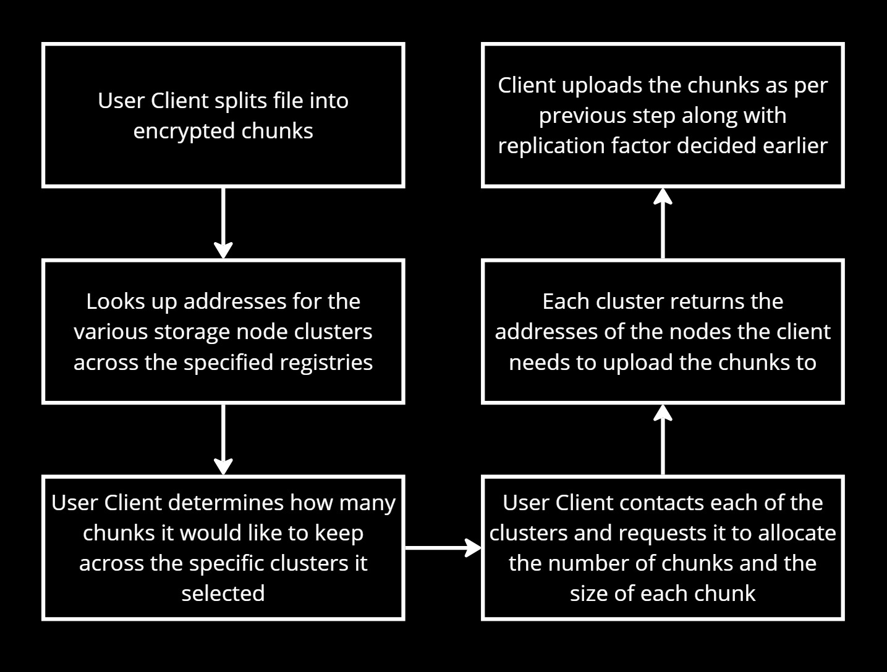

<p align="center">
  
</p>

<h1 align="center">Decentralized File Storage Network (dFSN)</h1>

dFSN is a small distributed file storage network which allows the user to split and disperse their files over a network ensuring that other than the user no one else can re-construct the files. The network utilises gRPC for transmission and sodium for file encryption. The network is peer-to-peer eliminating any middle man between the user and the storage nodes.

>**Note**: The project includes vendor headers and files. Please see the associated [licenses](.licenses).

## Network Architecture
The network has two interoperable variants: Organization Hosted and Open.

The network can be used as a secure storage medium especially for archival storage for eg. blueprints, customer documents (PII), etc. that are not accessed frequently but are extremely sensitive. For such use cases, tracking servers allow the organization to have a more greater control over where the chunks are being stored, the process of actually creating the chunks and reconstructing the file can only be done by the uploading user.


<p align="center">Organization Hosted dFSN</p>

The second variant is the *true* decentralized file storage network where only the uploading user decides where and how the chunks are stored. Each storage node cluster follow a *db-cluster* like topology where a leader node is responsible for handling incoming nodes, replicating and dispersing them across the cluster and following a robust failover procedure (*under development*).


<p align="center">Open dFSN</p>

### Work Flow
The diagram describes the overall workflow from the user client's perspective.


There are broadly three steps *after splitting the file* into encypted chunks:
- Choose the clusters where the chunks are going to be stored
- Request each cluster to allocate space for your chunks with appropriate replication
- Upload the chunks to the specific nodes as told by the respective clusters.

## Technology Stack
- C/C++
- gRPC
- Sodium
- protobuf
- SQLite
- Angular

### Ideology behind the Network
As illustrated in the diagram, the user client would decide the distribution of encypted chunks and the storage nodes which the client would send these chunks to would be decided by the tracking server.

The *tracking server* will now be a separate process running only in the leader storage node. In each *storage custer* there would be a leader node that in addition to being a storage node would also serve as the tracking server and allocating storage across the enitre cluster. For every cluster, there will be a pre-defined *chain of command* and in case of the leader node going down the next highest node would automatically assume leadership. There is also one and only one *Heap Service* per cluster, this service maintains an in memory fibonacci heap (which as of now is used for allocation) and the entire chain of command. The leader node also maintains a copy of the fibonacci heap, in case of a Heap Service failure, the cluster can still operate in a *degraded mode*, all operations other than failover are possible in degraded mode.

>**Note**: Unless the specific client that dispersed the chunks gets compromised. Since only that specific client knows on which nodes the chunks exist.

- From a commercial standpoint, if we were to present this as a decentralized Google Drive or Dropbox of some sort then we can store the dispersion information (see above note) in a backup service and charge users for that service. Ofcourse that service would be optional and you can avoid using it by simplying managing that information yourself.

If this were commercial how would we get the storage nodes?
- Businesses which have their own hosting infrastructure generally have spare storage space which they don't really use but still have to bear the expense of maintaining it. Such players can devote a set (guranteed for use by dFSN) amount of storage to the network, have their own tracking server and charge users / incentivise them to use their nodes.

- Since this is a decentralized network nodes can go down and may never come back up since they are not under our direct control. To mitigate this each chunk will obviously be on more than one node for redundancy purposes, and the users can have an option to also disperse some or all of their chunks to one or more of the above mentioned privately owned chunks which would be guranteed to be up.


## Setup
1. Setup **gRPC (1.66.0)** for C/C++ by following the guide on [grpc.io](https://grpc.io/docs/languages/cpp/quickstart/)

2. Setup libsodium (you can install it via apt package manager if on Debian based distros): [Sodium docs](https://doc.libsodium.org/installation)

3. Clone the repository via `git clone https://github.com/B4S1C-Coder/Decentralized-File-Storage.git`

4. In the [dfs-core/CMakeLists.txt](dfs/CMakeLists.txt) find the below snippet and add your gRPC Plugin path as shown:
```cmake
protobuf_generate(
  LANGUAGE grpc
  OUT_VAR GRPC_SRCS
  TARGET protolib
  GENERATE_EXTENSIONS .grpc.pb.hh .grpc.pb.cc
  PLUGIN "protoc-gen-grpc=/your/path/to/your/grpc_install_dir/bin/grpc_cpp_plugin"
  IMPORT_DIRS ${CMAKE_CURRENT_SOURCE_DIR}/../proto
  PROTOS ${PROTO_FILES}
)
```
5. Install npm packages: `npm i`

6. Last but not the least build the project:
 - In the project root run: `mkdir build && cd build && cmake .. && make`
 - The build should progress smoothly provided you have set-up gRPC and Sodium correctly
 
>**Note**: This project is being developed and tested on `WSL2 Ubuntu 24.04.2 LTS` with `g++ (Ubuntu 13.3.0-6ubuntu2~24.04) 13.3.0`. It is recommended that you use Linux or WSL, however as of writing, there are no platform specific components.
