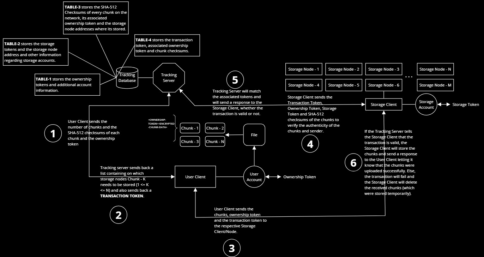

# Decentralized File Storage Network (DFS)
DFS is a small distributed file storage network which allows the user to split and disperse their files over a network ensuring that other than the user no one else can re-construct the files. The network is based on gRPC and peer-to-peer communication, there is no middle man between the user and the storage node.

>**NOTE**: This project uses third party libraries. Please check in the [licenses/](licenses/) folder for the respective licenses of the libraries.

## Techstack
- [Django](https://www.djangoproject.com/)
- [Django REST Framework](https://www.django-rest-framework.org/)
- [gRPC](https://grpc.io/)
- [protobuf](https://protobuf.dev/)
- [MySQL](https://www.mysql.com/)
- [SQLite](https://sqlite.org/)

The diagram below shows a detailed working of DFS.

>**Note**: As of now the project is under development and the first prototype will be implemented in python and C/C++ after that everything will likely be converted to C/C++ (or any other compiled language).

## Targets for First Prototype

- **Storage service for less conscious users**: Normally the information regarding which chunks are stored on which node is kept strictly on the client machine to adhere to the main goal of the project. However, if the client wishes they can store this information on a tracking server (**this is optional**) so that when they change machines they do not have to manually import the data (previously mentioned) to the new machine.

- Create a CLI and a GUI (desktop)

## Setup
For this project it is highly recommended that you use Linux or WSL. All the scripts and setup scripts are made with Linux or WSL in mind. You can install packages like `x86_64-w64-mingw32-g++` for compiling the project on WSL for windows.

### Quick Way
For a quick setup, just download [project_setup.sh](project_setup.sh) file if you're on Linux or WSL. Then simply run `./project_setup.sh` (put the script where you want the project to be). Do ensure that the script has the necessary permissions.

The script will ask some questions along the way for the setup.

>**NOTE**: As of now the script is still under development. For distros that are **not** Debian based, you will have to build external dependencies yourself according to their respective guidelines. However, there are plans to possibly automate this if possible.

### Manual Way
1. Clone the repo via `git clone https://github.com/B4S1C-Coder/Decentralized-File-Storage`

2. Create a virtual environment via `virtualenv .proto-env` (the name ".proto-env" is already included in `.gitignore`, you can change the name according to your needs)

3. Activate the enviornment and install dependencies:
  - `source .proto-env/bin/activate` for Linux and `.proto-env/Scripts/activate.bat` for Windows
  - `pip3 install -r requirements.txt` replace "pip3" with "pip" for Windows

4. Generate `_pb2.py`, `_pb2_grpc.py` for gRPC:
  - `python3 -m grpc_tools.protoc -I"protos/" --python_out="dfs_storage_node/" --pyi_out="dfs_storage_node/" --grpc_python_out="dfs_storage_node/" protos/filetransfer.proto` replace "python3" with "python" for Windows.
  - The files would be generated in `dfs_storage_node/` **copy** them to `dfs_user_client/` since the client would also need those files in order to communicate with the storage node.

5. Build external dependencies. Build [sodium](https://doc.libsodium.org/installation) from source. The static library would be in the `libs/` folder and the dynamic in `build/dev/` and `build/release/`.

>**Alternate**: If you are on a Debian based distro then, you can install the package `libsodium-dev` via `sudo apt-get install libsodium-dev`. Then you can find the .so and .a files with `find /usr/lib -name "libsodium.so" | head -n 1` and `find /usr/lib -name "libsodium.a" | head -n 1`. Then `cp` the `libsodium.so` to `build/dev/` and `build/release/`, `cp` the `libsodium.a` to `libs/`.

6. Build the binaries (assuming `g++`) (in one line):
  - For Linux: `./scripts/build_dfs-core-linux-with-python`
  - For Windows: see the command in the script for linux and change it accordingly to your setup.

  >**Note**: For Windows you can omit the `-static-libgcc` flag if you have `msvcrt.dll`, basically you can omit this flag if your compiled C/C++ code does not raise the error "Can't find msvcrt.dll" on execution. But on a safer side you can use this flag but this increases the size of the final binary.

>**Note**: If you get `undefined reference to: symbol` in `dfs_user_client/filesplit.py` at runtime, there is a high chance that there is name mangling in you .so / .dll. To check the exported symbols of the .so use `nm debug/<your binary name>.so`, this will show you the exported symbols. If you see symobols such as `_Z32divideFileIntoChunks_unencryptedPKciS0_iS0_` it means there is name mangling in your binary. In this case you can either recompile the binary and ensure that the header files have `extern "C" {DFS_EXPORT int functionName(...);}` OR inside `dfs_user_client/filesplit.py` you can replace `divideFileIntoChunks_unencrypted` with `_Z32divideFileIntoChunks_unencryptedPKciS0_iS0_`.

>**Optional**: Edit `dfs_user_client/filesplit.py`, set `so_dll_path = os.path.join(ROOT_DIR, "debug", r"<Name of the output binary generated in step 5>")`. It is better to use absolute paths whenever importing a DLL / SO (these must not have name mangling). This is if you want to run the filesplit tests (filesplit would be deprecated soon).

7. `mkdir dfs_storage_node/data` then `mkdir dfs_user_client/client_storage` then `mkdir dfs_user_client/client_storage/chunks` then `mkdir dfs_user_client/client_storage/chunks/client_storage` put the payload (to send to storage node) in `dfs_user_client/client_storage/`. As of now all the tests use `dfs_user_client/client_storage/text1.txt` as a payload.

>**Note**: The script is only tested on Linux (WSL), if you are on Windows either risk it or just use WSL. The last step is just some directories according to the present code, you can change it to your liking.

## Some Guidelines
- Always be in the root directory.
- Whenever you run a testing or a building script always run it from the root directory.
- You would generally **not** be in the root directory whenever you have to run the project.

## Running the Project
1. Activate the virtual environment.

2. `cd dfs_storage_node/` then `python3 storage_node.py`

3. In a different terminal repeat step 1, then `cd dfs_user_client/` then `python3 user_client.py`